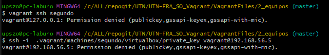

# Base de Conocimiento

## Problemas de Conexion a las VM

- [ ] ** Problemas para conectarme a la VM**

    > Los comandos "vagrant ssh" o . 
    > ssh -i private_key vagrant@192.168.56.5 . 
    > En VM basadas en RedHat 8 o superior . 
   

     
&emsp; <Mostrar/Ocultar> - Screen del Error

   

   <table>
      <tr>
         <td></td>
      </tr>
   </table>
   

   

   
   Solucion:
   -  Hay un Bug detectado en la version de vagrant 2.4.1 [Issue](https://github.com/hashicorp/vagrant/issues/13309)
   > NOTAS:
   > Conciste en que se esta copiando o generando mal el certificado ssh privado. Al trabajar contra Box basadas en RedHat >= 8 (y derivados).
   >    Por tal motivo Tira error al quererse logear.
   >    ~~Aparentemente con agregar el siguiente parametro  en el "vagrantfile"~~
   >     config.ssh.insert_key = false
   >    No se generaria una key privada y no se copiaria a la vm..
   >    de esta forma, si bien no se podria ingresar con el comando ssh
   >    Si se podria ingresar usando "vagrant ssh"

