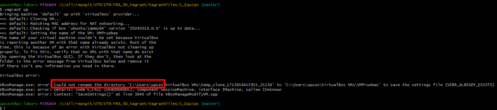
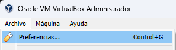
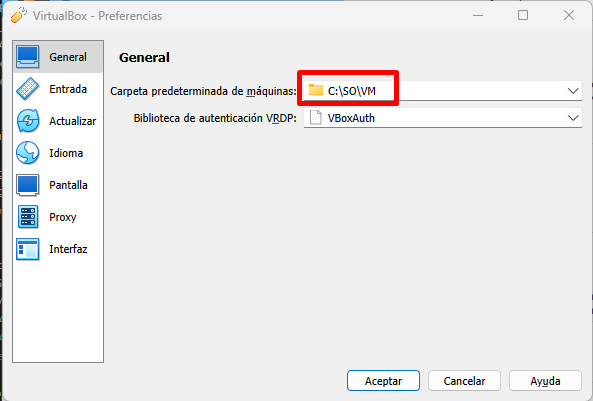
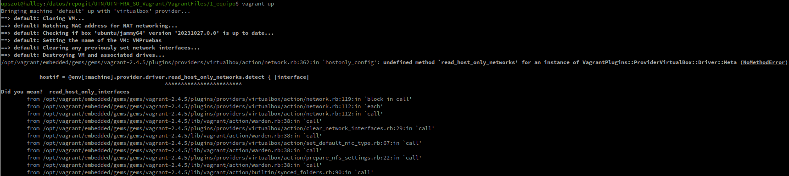

# Base de Conocimiento


## Problemas Crear una VM

- [ ] **Problemas Crear una VM - (Permisos Para Renombrar)**
    > Tras ejecutar "vagrant up" sale un error diciendo que ya existe una VM con dicho nombre.</br>
    > Tambien que NO puede Renombrar un directorio "c:\user\ **EL_USUARIO_DE_USTEDES**"</br>
    > Por si fuera poco, llego a generar una VM en virtualbox a la cual no le pudo cambiar el nombre.
   <details>
     <summary>&emsp; <Mostrar/Ocultar> - [Click para ver] -> Screen del Error</summary>
   <div>
   <table>
      <tr>
         <td></td>
      </tr>
      <tr>
         <td></td>
      </tr>
   </table>
   </div>
   </details>

   Solucion:
   - Paso1 - Eliminamos todo Rastro de la maquina virtual y metadata de vagrant
```sh
#- Verificamos si en VirtualBox existe una VM con dicho Nombre.
#- Eliminamos la VM con el comando o Manualmente desde VirtualBox:
vagrant destroy -f 
#- Eliminar carpeta de metadata de vagrant
rm -rf .vagrant
```
   - Paso2 - Modificamos en la configuracion de VirtualBox el path por defecto donde se alojan las VM
<div style="margin-left: 40px;">
   <details>
     <summary>&emsp; <Mostrar/Ocultar> - [Click para ver] -> Screen cambiar preferencias</summary>
   <div>
   <table>
      <tr>
         <td></td>
      </tr>
      <tr>
         <td></td>
      </tr>
   </table>
   </div>
   </details>
</div>

> NOTA: La mayoria de los Errores al levantar VM se soluciona de esta forma. </br>


</br>
</br>


- [ ] **Problemas Crear una VM - (Problema con la red)**
    > Tras ejecutar "vagrant up" aparece un error  de red ( `hostonly_config': undefined method `read_host_only_networks') [Ver Issue](https://github.com/hashicorp/vagrant/issues/13655)
   <details>
     <summary>&emsp; <Mostrar/Ocultar> - [Click para ver] -> Screen del Error</summary>
   <div>
         <td></td>
   </div>
   </details>

   Solucion:
   - Paso1 - Buscamos en el archivo `Vagrantfile` la configuracion de red.. 
```sh
# Linea anterior
config.vm.network "private_network", :name => '', ip: "192.168.56.2"
```
> El numero de IP puede variar entre archivos...(resperar la que estaba)

   - Paso2 - Agregando en dicha linea la opcion `, virtualbox__intnet: true`
```sh
# Nueva Linea
 config.vm.network "private_network", :name => '', ip: "192.168.56.2", virtualbox__intnet: true
```
> Esto le indica explícitamente a Vagrant que configure la red privada como una red interna de VirtualBox,</br>
> evitando el intento fallido de interactuar con las redes "solo-anfitrión" que causaba el error


